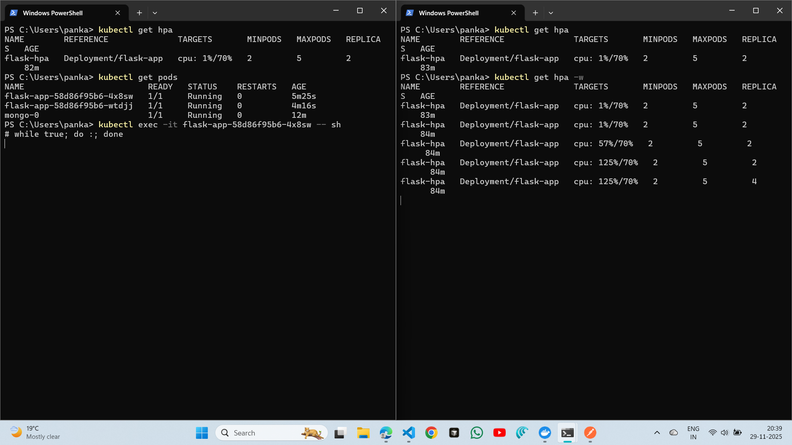

# Python Flask App Deployed using K8s

## Building the Dockerfile and Pushing to registery

### Build the Image

Creates a Docker image for the Flask application.

Run `docker build -t Docker-hub-username/image-name:version .`

**Example**

`docker build -t pankaj42se/flask-app:v1 .`

### Login to Docker Hub

`docker login`

*Enter your username and password*

### Push Docker Image to DockerHub

`docker push image_name`

**Example**

`docker push pankaj/flask-app:v1`

## Steps to deploy Flask App and mongoDB using Kind

### Create a Kubernetes Cluster using kind

Creates a multi-node local Kubernetes cluster using a YAML configuration.

`kind create cluster --config create-cluster.yml -n flask-cluster`

### Load Docker Image of Flask App in cluster

Loads the Flask Docker image directly into the kind cluster so it can be used without pulling from Docker Hub.

`kind load docker-image pankaj42se/flask-app:v1 --name flask-cluster`

## MongoDB Deployment

### Apply MongoDB Authentication Secret

Creates a Kubernetes Secret to securely store MongoDB username and password.

`kubectl apply -f mongo-secret.yaml`

### Apply MongoDB Persistent Volume and Claim

`kubectl apply -f mongo-pv-pvc.yaml`

### Apply MongoDB StatefulSet

`kubectl apply -f mongo-statefulset.yaml`

### Apply MongoDB Service

Creates an internal ClusterIP service to allow Flask to connect to MongoDB using DNS.

`kubectl apply -f mongo-service.yaml`

### Deploy Flask Application

`kubectl apply -f mongo-service.yaml`

## Flask Application Deployment

### Apply flask App service File

Exposes the Flask application inside the cluster and enables external access using port-forwarding.

`kubectl apply -f flask-service.yaml`

### Apply Horizontal Pod Autoscaler

Automatically scales Flask pods based on CPU utilization.

`kubectl apply -f flask-hpa.yaml`

### Install Metrics Server for finding CPU usage

` kubectl apply -f https://github.com/kubernetes-sigs/metrics-server/releases/latest/download/components.yaml`

*Edit Metrics Server Configuration for Kind*

`kubectl edit deployment metrics-server -n kube-system`

Add this line `  - --kubelet-insecure-tls` inside *containers* -> *args*

### Port Forward Flask Service

` kubectl port-forward service/flask-service 5000:5000`

**Run `http:localhost:5000` in your browser**

## How DNS working for Inter-pod Connectivity

Services are assigned stable DNS names that resolve to dynamic pod IPs instead of hardcoding addresses, allowing applications to communicate with each other.

## Resource Request and limits

Resource requests guarantee minimum resources for scheduling and limits restrict the maximum resource usage of a container at runtime

## Specific Configuration set-up

I choose *kind* instead of *MiniKube* because its Lightweight and fast local Kubernetes cluster and already installed in my laptop.

Create kubernetes cluster using create-cluster.yml to start 3 nodes 1 master and 2 worker nodes instead of direct cli command because it create 1 node which work as both worker and master

## Test database Interaction

Access the application using `kubectl port-forward service/flask-service 5000:5000`

send POST request using postman on http://localhost:5000/data
```
{
    "sampleKey" : "sampleValue"
}
```

send GET request using postman on http://localhost:5000/data retrieve data successfully

## Data Persistence Test

Delete MongoDB pod using `kubectl delete pod mongo-0` and k8s recreate automatically then send GET request again retrieve data successfully
```
[
    {
        "sampleKey": "sampleValue"
    }
]
```

## AutoScaling Testing

Get all Pods using `kubectl get pods`

Result
```
NAME                         READY   STATUS    RESTARTS   AGE
flask-app-58d86f95b6-4x8sw   1/1     Running   0          5m25s
flask-app-58d86f95b6-wtdjj   1/1     Running   0          4m16s
mongo-0                      1/1     Running   0          12m
```

SSH into one pod `kubectl exec -it flask-app-58d86f95b6-4x8sw -- sh`

Run infinite loop using
`while true; do :; done`

Observe Results in another terminal
using `kubectl get hpa -w`

